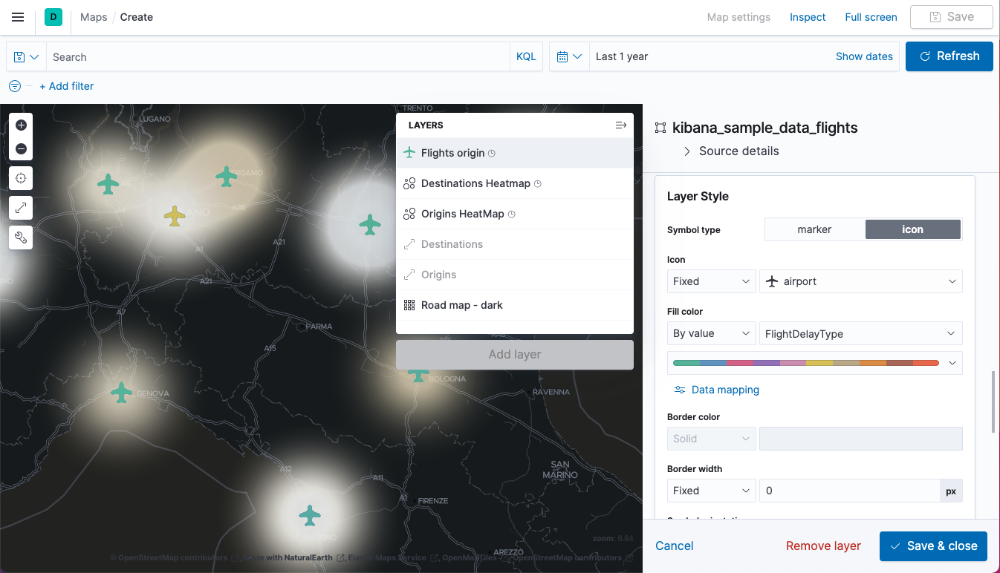

# Demo scripts used for S02E09 - Elastic Daily Bytes - Kibana Maps


## Setup

The setup will check that Elasticsearch and Kibana are running.

It will also add Kibana Canvas slides.

### Run on cloud (recommended)

This specific configuration is used to run the demo on a [cloud instance](https://cloud.elastic.co).
You need to create a `.cloud` local file which contains:

```
CLOUD_ID=the_cloud_id_you_can_read_from_cloud_console
CLOUD_PASSWORD=the_generated_elastic_password
```

Run:

```sh
./setup.sh
```

### Run Locally

Run Elastic Stack:

```sh
docker-compose down -v
docker-compose up
```

And run:

```sh
./setup.sh
```

## Kibana Maps

Kibana Maps are useful to represent whatever geo related data.

## Demo part

You should import Kibana Sample Data Flights if not already available.

### Dataset

Open the Dev Console and run a simple search to show what the data looks like:

```json
GET /kibana_sample_data_flights/_search
```

A document looks like this:

```json
{
  "FlightNum" : "SFKI761",
  "DestCountry" : "IT",
  "OriginWeather" : "Cloudy",
  "OriginCityName" : "New Delhi",
  "AvgTicketPrice" : 1063.3514109538767,
  "DistanceMiles" : 3889.5758923959584,
  "FlightDelay" : false,
  "DestWeather" : "Sunny",
  "Dest" : "Turin Airport",
  "FlightDelayType" : "No Delay",
  "OriginCountry" : "IN",
  "dayOfWeek" : 6,
  "DistanceKilometers" : 6259.665624972082,
  "timestamp" : "2021-06-13T04:24:30",
  "DestLocation" : {
    "lat" : "45.200802",
    "lon" : "7.64963"
  },
  "DestAirportID" : "TO11",
  "Carrier" : "Logstash Airways",
  "Cancelled" : false,
  "FlightTimeMin" : 368.2156249983577,
  "Origin" : "Indira Gandhi International Airport",
  "OriginLocation" : {
    "lat" : "28.5665",
    "lon" : "77.103104"
  },
  "DestRegion" : "IT-21",
  "OriginAirportID" : "DEL",
  "OriginRegion" : "SE-BD",
  "DestCityName" : "Torino",
  "FlightTimeHour" : 6.136927083305962,
  "FlightDelayMin" : 0
}
```

Every document represents a flight.

* `Origin`: airport origin
* `Dest`: airport destination
* `DistanceMiles`: distance in miles
* `AvgTicketPrice`: average ticket price

We have the duration of the flight with `FlightTimeMin`, also the weather at the origin and at the destination with `OriginWeather` and `DestWeather`, the carrier with `Carrier`.

We can see some location fields like `OriginLocation` and `DestLocation`.
Also we have some informations about the countries with `OriginCountry` and `DestCountry`.

Also some informations about the delay if any with:

* `FlightDelay`: boolean indicating if there has been a delay.
* `FlightDelayMin`: duration in minutes of the delay if any.
* `FlightDelayType`: let's have a look at the list of delay types we can have:

```json
GET /kibana_sample_data_flights/_search
{
  "size": 0,
  "aggs": {
    "delays": {
      "terms": {
        "field": "FlightDelayType"
      }
    }
  }
}
```

Let's see how we can plot that on a map.

### Start the Map

Open Maps and create a new Map.

The map is provided by [Elastic Maps Service](https://maps.elastic.co/). Show some layers like french departments.
The World Countries dataset has ISO2 representation and the name. 

We can may be use that. Back to the Map.

### Choropleth layers

Add Choropleth layer. Select World Countries and do a join on ISO2 and index `kibana_sample_data_flights` with its `OriginCountry` field. Add the layer and name it `Origins`.


Add a new Choropleth layer. Select World Countries and do a join on ISO2 and index `kibana_sample_data_flights` with its `DestCountry` field. Add the layer and name it `Destinations`.
Use a blue color palette to better see the difference.


Show that you could change the metric used from a count to an average aggregation on `AvgTicketPrice`. 


But switch back to `count`.

Show that you can disable the Destinations layer if you wish.


If you zoom on France, you can click on the geometry and show the values for Destinations and Origins.


### Heatmaps

Let's add a new layer. A HeatMap on `OriginLocation` and call it `Origins HeatMap`. Choose the orange palette.


Create the `Destinations Heatmap` the same way. Choose the blue palette.


Zoom again. May be we should stop displaying the Origins and Destinations layers at some zoom level.
Let's change that.


Change the Road map layer to use the dark tile.


### Documents

Zoom again to Italy.

Let's add the aircrafts by adding a new layer "Documents" named `Flights origin`. 


Let's decide that they will appear from zoom level 6.
Add the following fields to the tooltip:

* `Carrier`
* `Origin`
* `Dest`
* `DistanceMiles`
* `AvgTicketPrice`
* `FlightTimeMin`
* `FlightDelayType`
* `FlightDelayMin`
* `OriginWeather` 
* `DestWeather`


Also change the layout to use airport icon, set the fill color to "By value", on `FlightDelayType`, fix the border width to 0 and the Symbol size to 14.



Show one of the flights.


### Lines

Zoom in again and change the Zoom level for heat maps to max 7.

Let's add a line to show the path from the origin to the destination.
Add a "Point to Point" layer named "Flights".


Zoom out to the whole view.


Select only flights with `FlightDelayType : "Weather Delay"`.
Zoom again on Italy.

Change the Metric to Max on FlightDelayMin and choose the colorful palette.


### In a dashboard

Open the Flights Dashboard and show the map added to the dashboard.


Select the `Carrier : "Kibana Airlines"` flights and filter from `IT` to `US`.


### In Canvas

Go back to the presentation and show the last slide.


